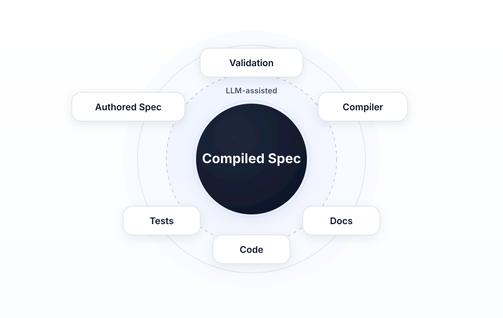

# Conversational Software Engineering: Compiling Intent

In a previous article, ["AI Didn't Simplify Software Engineering"](https://robenglander.com/writing/ai-did-not-simplify/), I argued that AI made bad engineering easier, not simpler. Code was never the hard part; the hard part is keeping intent, specification, tests, and implementation aligned. When that alignment goes, systems drift—and faster generation accelerates drift. Dijkstra, Hoare, Knuth, and others were already saying as much decades ago; the tools have changed, the problem hasn't.

This piece is about one response. Not the only one, but a concrete approach: a way to let LLMs help write specifications, generate candidate artifacts, and write code and documentation, without giving them authority over correctness. I call it Conversational Software Engineering, or CSE. The thesis is simple: conversation with an LLM becomes the interface, and the system underneath is deterministically validated. The discipline is the compilation of intent into artifacts that can be validated, tested, and maintained. No hand-waving. You'll see the boundaries, the artifacts, and where the engineer stays in charge.

---

## Conversation as the Control Surface

Conversation isn't a one-off step. It's the primary way engineers interact with the system: exploring behavior through dialogue, authoring and modifying specifications, investigating validation failures, requesting generation, asking for explanations. Conversation is the control surface of the engineering system—where intent enters and where the system gets steered.

But conversation is not the artifact. It's input. It has to be translated into something durable that can be validated, tested, and maintained. You can't build a reliable system on a chat history. Chat is exploratory—full of false starts, clarifications, and half-formed ideas. Treating that as the source of truth is a recipe for the same drift the previous article described. So the control surface has to feed something that can be parsed, checked, and held accountable.

The progression is: Conversation → Structure → Determinism. Intent gets expressed through conversation; structure removes ambiguity through constrained representations, contracts, and explicit assertions; determinism is where those structured artifacts get checked mechanically. CSE is built around that progression. Each step has a clear output, and nothing is left implicit at the boundary.

---

## The First Durable Artifact: The Authored Specification

The first durable artifact is the authored specification: human-readable, structured, the canonical expression of intent. This is what conversation is supposed to produce—or refine—when the goal is engineering, not just exploration. In CSE, that conversation is with the LLM. The authored spec isn't only read by people; it's written through conversation with the LLM. The engineer describes what the system should do, asks for a new behavior or an acceptance test, requests a change to a section, or refines a directive. The LLM drafts and revises the spec in dialogue. The control surface—conversation—is where the authored spec comes from. The artifact is the outcome of that collaboration.

That collaboration has rules. There's a language specification that defines how the authored spec must be written: the allowed structure (which sections exist and in what order), the form of behaviors (canonical prose forms, contract blocks), the form of acceptance tests (given/when/then, observable assertions only), and the form of implementation directives (targets, intent, operational clarity). The LLM uses this language to write and edit the spec. When the engineer says "add a behavior for when the balance is negative," the model doesn't invent a format—it follows the behavior language. When the engineer says "add an acceptance test for that," it follows the acceptance-test language. The engineer can say anything in conversation; what comes out, though, conforms to the spec language. That's what makes it parseable, decomposable, and compilable.

It isn't free-form prose. It follows a fixed structure: defined sections (purpose, behaviors, acceptance tests, references, and so on). That structure exists so every spec can be deterministically decomposed—sections, units, boundaries—without using an LLM. You don't need a model to find where one behavior ends and the next begins; a parser can do it, and the result is the same every time. That decomposition is the input to compilation. If you can't decompose the spec mechanically, you've already lost—the rest of the pipeline depends on that step being reliable.

Behaviors state what the system shall do; acceptance tests state preconditions, action, and postconditions; implementation directives capture constraints and guidance for code generation—for example, "Use BigDecimal for all monetary arithmetic; never use floating point." A directive isn't a behavior assertion; it's an instruction the code generator must satisfy. All of it uses a controlled natural language: canonical forms, explicit contracts, observable assertions. "Controlled" means you give up some flexibility; in return you get something tools can interpret consistently. No guessing what "the system shall round to the nearest cent" actually implies; the contract spells it out.

This is where intent lives and authority starts. Everything downstream either derives from this or is verified against it. The engineer and the LLM work together to produce it—but the language specification is what makes that collaboration yield an engineering artifact instead of a chat log.

---

## From Authored to Compiled: Two Artifacts by Design

The authored spec is for people; the compiled specification is for machines—normalized, canonical, one language for reading and writing, another for analysis and generation. Unlike a conventional compiler, compilation here is probabilistic and LLM-assisted: the same authored spec, different day, can yield a different compiled candidate—correct, partial, or wrong. It can't be the final authority by itself; that's why validation exists. You run the model's output through a deterministic pipeline that says yes, no, or "fix this." The model proposes. The system decides.

The compiled form sits in a middle zone by design: structured enough to parse and validate deterministically, simple enough for reliable model generation. If the compiled language were too formal—full predicate logic, say—generation would fail more often and you'd be back to fighting the model; if it were too loose, you couldn't validate it. So validation rigor is applied in layers—structure first, then deeper semantics—rather than by over-formalizing the surface language. The approach leans into how LLMs work instead of fighting them.

---

## The Spec DSL: Generation and Validation

The compiled specification is expressed in a spec domain-specific language (DSL)—a language with a defined structure so every compiled artifact can be parsed and interpreted by tools. The DSL is the target of compilation, not the authored language. It's not a fully formal language in the sense of predicate logic or expression trees. Many of its fields—conditions, assertions, preconditions, outcomes, directives—hold normalized semantic text: short, consistent statements like "result = 100" or "mode = HALF_UP." These aren't modeled as full formal predicates; they're text that carries meaning in a stable, parseable form. The DSL sits in the Goldilocks zone: structured enough for deterministic parsing and tooling, simple enough for models to generate and interpret reliably.

That design leans into how LLMs work rather than fighting them. Textual semantic statements are easier for an LLM to generate than strict formal syntax—smaller grammar, lower failure rate. The model emits normalized text; tools parse it and, in deeper validation layers, interpret it. When the compiled spec feeds code generation, LLMs can read those statements and infer intent without the DSL embedding an implementation language. The system doesn't force the model to act like a deterministic compiler front end; it lets the LLM work at the surface while deterministic systems handle the rigor underneath. Validation rigor is relocated, not abandoned. Deep validation—interpreting conditions and assertions, resolving references, checking consistency—is layered on top of the parsed DSL. The surface stays LLM-friendly; the layers beneath can be as strict as needed. CSE doesn't weaken validation to accommodate LLMs; it relocates validation to layers that don't burden the model-facing language.

Compilation works at the unit level. Each authored unit—a behavior, an acceptance test, or an implementation directive—is compiled separately. For each unit type there's a unit grammar that defines the valid shape of the compiled output. The LLM is given the authored unit and constrained to produce a fragment that conforms to that grammar—the constraint is applied at inference time, restricting the token sampler to sequences that produce valid DSL, so a malformed unit can't be emitted. The grammar acts as a guardrail: the output is either well-formed for that unit or it isn't. After all units are compiled, an assembly step combines the fragments into a single compiled spec—one coherent DSL document that can be parsed, validated, and passed to downstream generation. Decompose the authored spec, compile each unit with grammar-constrained generation, then assemble. That's the pipeline.

Once you have a parsed compiled spec, validation can go beyond syntax. The DSL exposes structure—behaviors, conditions, outcomes, references, directives—so validators can do deep validation: interpret semantic content of fields, resolve references, check consistency, run spec-surface checks (dependencies, graph, cycles, coverage). Parse first; then apply semantic and graph-level checks that depend on that structure. The same DSL that makes generation tractable for the LLM makes rigorous validation tractable for the system.

---

## Stochastic Backsliding

There's another problem that shows up quickly once you start compiling specifications this way.

The compilation step is probabilistic. Same input doesn't guarantee the same output—and it doesn't guarantee a *better* output. So even if nothing in the authored spec changes, the compiled result can. Sometimes it gets better; sometimes it gets worse. You can improve a section of the specification, recompile, and end up with a result that's objectively worse than before. This isn't a bug. It's inevitable. It's a property of the system.

That's stochastic backsliding. Without a mechanism to detect it, the system can degrade over time even as you refine the specification. The degradation is invisible: you think you're iterating forward; you may be iterating backward and never notice. Unit-level compilation and retention are the fix. Each compiled unit is evaluated independently; if a newly generated unit is worse—lower confidence, weaker structure, or poorer alignment—it's rejected in favor of the previous version. The model proposes. The system decides. That distinction is what prevents a probabilistic process from eroding a deterministic artifact.

---

## The Validated Boundary Is the Center of Gravity

The artifact that matters for automation isn't "a compiled spec exists." It's the validated compiled spec—the compiled spec plus a validation state: pass, warning, error, or stale. Downstream systems don't consume "whatever came out of the compiler"; they consume an artifact that's been checked and given a state, and that state is what the gate consults before allowing automation to run.

Validation is deterministic—syntax, semantics, consistency across the spec—so you put a candidate in and get a validation state out. That state is recomputable whenever the artifact changes. Edit the spec, revalidate; the state might flip to stale, then to pass or error. You always know where you stand. No silent drift. No "we think it's fine."

This is where probabilistic output either earns trust or doesn't. It's where tooling clusters: editors, validators, diagnostics, gating. The center of gravity in CSE isn't the prompt or the generated code; it's the compiled spec—validated before automation proceeds, and the source everything else derives from. Everything orbits that. Get that right and the rest of the discipline has something to attach to.



---

## Full Spec Surface Validation

Specs aren't written in isolation. They interact with other specs. A behavior or an acceptance test can be locally correct and still wrong or inconsistent with the rest of the system. Maybe the new behavior conflicts with a dependency. Maybe the test references a behavior that was renamed. Maybe the directive applies to a unit that no longer exists. An LLM doesn't have the whole graph in focus. Full spec surface validation is where that gap gets closed.

Beyond single-unit checks, validation runs across the entire spec surface deterministically. It considers dependencies between specs; references (which acceptance test exercises which behavior, which directive applies to what); the graph of behaviors, tests, and directives; cycle detection for circular dependencies; consistency of identifiers; coverage so every behavior is covered by at least one acceptance test; and cross-spec coherence. The validator answers: does this spec, as a whole, hang together? Does it fit the surface it's part of?

The compiled spec isn't just a bag of units. It's a connected structure in a larger surface. Deterministic validation over that structure catches whole-spec and cross-spec issues before any code or test generation runs. CSE treats "does this fit the surface?" as a first-class question, not an afterthought. Skip it and you'll find out later—in integration failures, in tests that don't match the graph, in code that doesn't plug in. Better to find out at the boundary.

---

## The Gate

Downstream systems—code generation, test generation, pipelines—don't ask whether a compiled spec exists. They ask one question: what is the validation state of the spec? That state determines whether automation proceeds.

The states are *unvalidated*, *pass*, *warning*, *error*, and *stale* (artifact changed since last validation). Stale means something changed and must be revalidated before it can be trusted. The gate doesn't infer intent; it reads the state and applies policy.

Policy is straightforward: pass → proceed; warning → proceed with judgment; error → stop until resolved. A behavior with no covering acceptance test, for instance, might surface as a warning rather than an error—worth flagging without blocking all downstream generation. This is a workflow boundary, not a lockout. The system makes the state visible. Engineers decide what to do with it.

---

## The Engineer Stays in Charge

Engineers can edit the authored spec. They can also edit the compiled spec—the IR (intermediate representation)—directly. Recompile. Revalidate. The compiled spec is editable because the compiler is probabilistic; small structural mistakes are inevitable (a missing bracket, a typo in an identifier, a condition flattened wrong) and they should be fixable directly without forcing another round of generation. Never force deterministic correction through a probabilistic system. If the fix is obvious, let the engineer make it. For example: the compiler might emit a condition like " = 100" with the left-hand side missing. That can pass structural parsing but fail semantic validation. The engineer fixes it directly in the IR, revalidates, and continues—no re-prompt required.

Fix it at the spec level and it flows downstream. One correction at the boundary improves tests, code, and docs—change the compiled spec and regenerate. The engineer remains the engineer: LLMs translate, engineers correct. That division of labor is intentional. It's what keeps the system from drifting when the model drifts.

---

## Generation from the Compiled Spec

The validated compiled spec is what drives downstream generation. Two main consumers: acceptance-test generation and production code generation. Once the spec is validated, it becomes the source from which test code and production code are derived. Not from conversation. Not from a fresh prompt. From the compiled artifact.

The format of the compiled spec sections—behaviors, acceptance tests, implementation directives—is designed to feed code generation. Normalized preconditions, actions, assertions, and directives; each section has a shape generators can rely on. Whether the generator is an LLM or deterministic, it produces test code and production code that align with the spec. The spec isn't a narrative a model has to interpret from scratch—it's a structured input. Preconditions map to test setup, actions to the operation under test, assertions to expectations, implementation directives to constraints the generated code must satisfy. The format does the work of making intent machine-usable.

The compiled spec isn't only for people or for validation. It's the machine contract for what tests and implementation must do. That's why the middle zone matters: the compiled form has to be both validatable and generative. Too loose and you can't generate reliably. Too rigid and you can't generate at all. The design of the compiled language is a design for that contract.

---

## Acceptance Test Fidelity

Acceptance test (AT) fidelity means ensuring that the AT code—the generated or hand-written tests—actually covers the AT sections of the specs. The tests contain assertions and code that fully cover the preconditions, action, and postconditions described in the compiled and authored spec. Not "we ran something that looks like the scenario." We asserted every outcome the spec says must hold.

Without a fidelity check, tests can drift. They might run the right scenario but assert too little. Or miss an assertion the spec requires. Over time, tests become decorative: they pass, but they don't verify what the spec says they should verify. Fidelity validation—or disciplined review—checks that each acceptance test's postconditions and observables are present and exercised in the test code. Do we have an assertion for this postcondition? Did we actually invoke the action under test? The loop closes when you can say yes with evidence.

Alignment isn't only "spec ↔ implementation." It's also "spec AT sections ↔ test code." AT fidelity closes that loop so acceptance tests remain true acceptance tests. Without it, you have two places for drift: spec vs implementation, and spec vs tests. With it, the tests become a reliable proxy for "does the implementation match the spec?"—because you've first ensured the tests match the spec.

CSE doesn't try to prove that production code directly matches the specification. Instead, it enforces that acceptance tests faithfully represent the specification, and that implementation satisfies those tests.

---

## Why This Restores Alignment

Intent is captured in the authored spec; the validated compiled spec is the single machine-facing truth; tests and implementation are generated from it or verified against it. The chain is: intent → authored spec → compiled spec → validation → downstream artifacts. Every step has an artifact and every boundary can be checked. You aren't inferring intent from code—you're deriving code from intent that's already been written down and validated.

Alignment is maintained at boundaries: authored vs compiled, compiled vs validation state, validated spec vs generated outputs. Drift becomes detectable at those boundaries. Structure at the compilation boundary makes incorrect transformations visible; tests and execution provide the semantic check. The approach doesn't promise perfect transformation—it promises that errors become detectable, findable, and fixable. You find out when something's wrong, you know where to look, and you have a place to fix it (the authored spec or the compiled spec) so the change propagates.

That's the same alignment problem I described in the Engineering Alignment whitepaper—spec, tests, and implementation staying in sync. CSE adds a durable representation of intent and a validated machine-facing artifact so that when conversation and LLMs are in the loop, you still have a clear alignment story. Conversation feeds the spec; the spec remains the anchor. [Engineering Alignment](https://robenglander.com/writing/engineering-alignment/).

---

## What This Looks Like in Practice

In my own work, this pipeline is being used to help build a real financial planning system, not just a demo. The grammars and validators are too detailed to cover here, but a small example makes the key idea concrete.

Here is an acceptance test written in the authored spec format—the form a person and an LLM working together produces through conversation:

```contract
AT-001 [B-001]: Given exactCents = 100.4
And mode = HALF_UP
When round(exactCents, mode)
Then result = 100
```

And here is the compiled form—what the compiler produces from it:

```
acceptance_test AT-001 {
  summary: "Rounding behavior for currency values"
  validates: [B-001]
  preconditions: [
    "exactCents = 100.4",
    "mode = HALF_UP"
  ]
  actions: ["round(exactCents, mode)"]
  assertions: ["result = 100"]
}
```

The authored form is what you write in conversation—readable, forgiving, writable by a person or an LLM following the spec language. The compiled form is what tools consume. Note that the `summary` field doesn't appear in the authored AT—it's generated by the compiler during unit compilation, a brief LLM-produced description of what the unit does.

The precondition string `"mode = HALF_UP"` isn't a natural language sentence and isn't predicate logic—it's a short normalized string that a validator can interpret and an LLM can generate code from. That's the Goldilocks zone in practice: you can read it, a parser can handle it for validation, and a model can generate it reliably because the grammar is small.

This is also where stochastic backsliding becomes visible. The compiler might generate `"mode = ROUND_UP"` instead of `"mode = HALF_UP"` in the precondition—structurally valid, semantically wrong. The mechanism for detecting this is token probability: the compiler records the logprob of each generated unit, and that signal drives the comparison. A drop in confidence flags the candidate for rejection—not proof of error, but a reason to prefer the prior version until someone reviews it.

The important point is that the discipline is visible. The layers between conversation and executable system are exposed. The industry keeps trying to skip straight from conversation to code. CSE proposes the opposite: build the discipline first, make the boundaries explicit, make validation deterministic, make the compiled spec the center of gravity. Only when that proves reliable does it become safe to hide some of that complexity. Until then, the layers are the point.

---

## Closing

Prompting is not engineering. The tendency to shortcut—to go straight from conversation to code—is real and persistent.

Intent must be expressed (authored spec), compiled (candidate), validated (state), and only then made operational (downstream generation). Skip a step and you've reintroduced the drift we're trying to prevent—the order matters because each step produces a checkable artifact and a clear place to correct.

If you're already using LLMs in your workflow, don't start with code generation. Start with the boundary—where intent becomes something the system can verify. Build that boundary first. Everything else depends on it.

We have been here in spirit before. Dijkstra, Hoare, Knuth, and others argued that the hard part of software has always been reasoning, specification, and proof—not code. CSE applies that same instinct to a world where part of the work is done by a large language model.

The future of software engineering in the presence of LLMs isn't "conversation to code." It's the disciplined compilation of intent, with the validated boundary as the center of gravity and the engineer still in charge. LLMs can sit at the control surface. They can write specs, tests, production code, and documentation. But they can't yet hold authority. An engineering discipline is required to make the most of this technology. Conversational Software Engineering is one formulation of that discipline.
